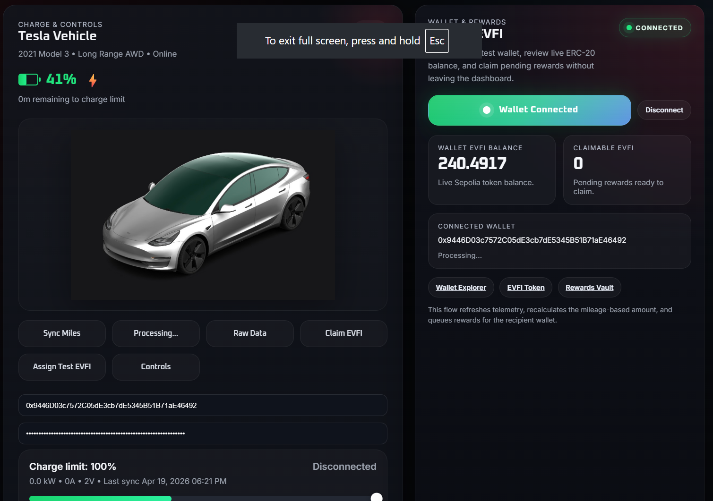
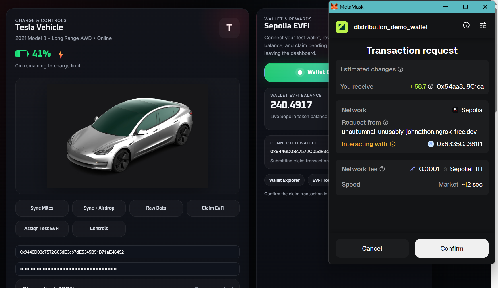
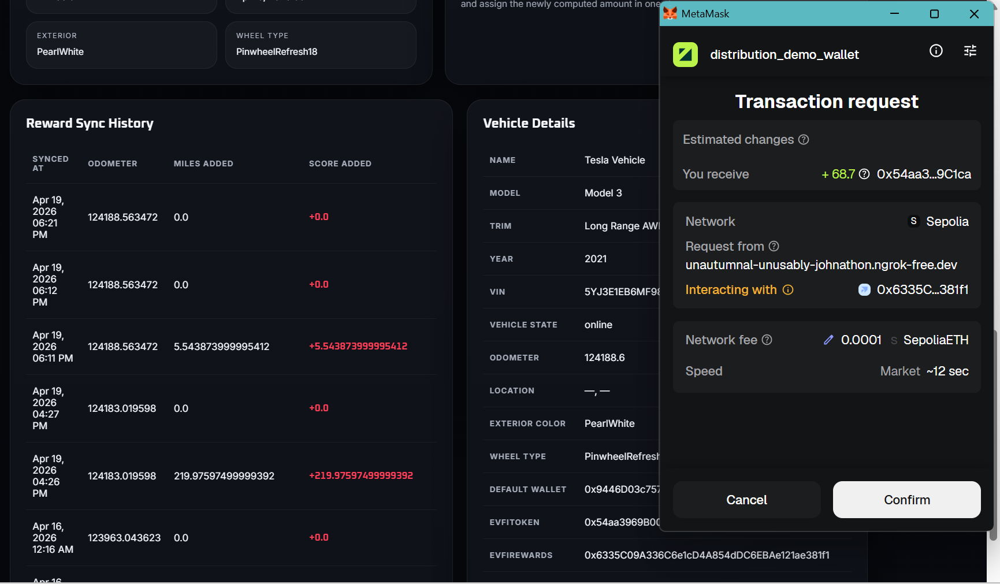
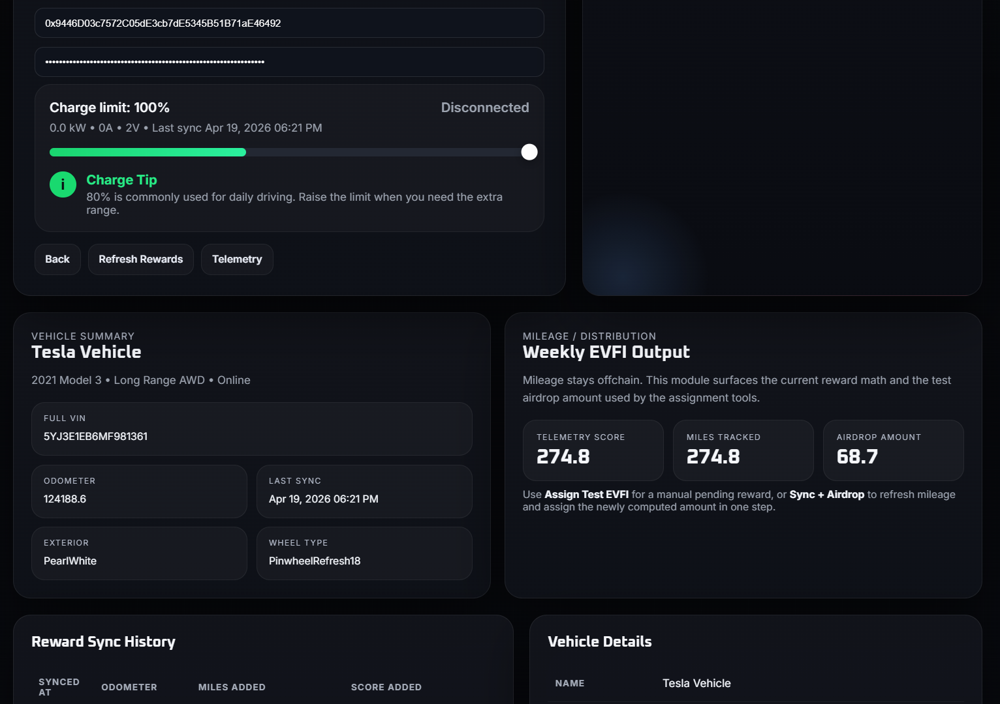

# EvFi

EvFi is a prototype EV rewards platform that connects Tesla Fleet telemetry to onchain incentives. The project combines a Flask-based demo app, Tesla OAuth and vehicle data sync, a local mileage ledger, and Sepolia smart contracts for reward assignment and claiming.

It is structured as a single repo for the full demo stack:

- Tesla Fleet API integration and OAuth flow
- Flask dashboard for telemetry and rewards UX
- SQLite-backed local mileage and reward history
- Sepolia `EVFI` token and rewards contracts
- Hardhat deployment, tests, and reward-assignment tooling

## Demo Preview

Add screenshots to `docs/screenshots/` using the filenames below and they will render automatically on GitHub.






## What The Demo Does

The current prototype flow is:

1. A user authenticates with Tesla OAuth.
2. The app reads Tesla vehicle data and odometer state.
3. Mileage history is stored locally in SQLite for scoring and demo tracking.
4. A wallet connects to the dashboard on Sepolia.
5. The app displays token balance and pending rewards.
6. Admin tooling can assign EVFI rewards based on accumulated mileage.
7. The user claims rewards onchain from the connected wallet.

## Repository Layout

```text
contracts/            Sepolia smart contracts
scripts/              Hardhat deployment and reward scripts
test/                 Contract tests
evfi_fleet_app.py     Python entrypoint for the Flask demo
evfi_fleet_core.py    Main Flask app, Tesla integration, and local ledger logic
evfi_assign_rewards.mjs
                      Node helper used by the app to assign rewards
static/               Frontend assets for the dashboard
data/                 Example local data fixtures
.well-known/          Tesla app-specific public key path
```

## Tech Stack

- Python + Flask for the local web app
- Tesla Fleet API for vehicle auth and telemetry
- SQLite for local mileage and reward tracking
- Solidity + Hardhat + Ethers for Sepolia contracts and scripts
- Plain JavaScript frontend wallet integration

## Requirements

- Node.js and npm
- Python 3.10+ recommended
- A Sepolia RPC endpoint
- Tesla developer app credentials
- A funded Sepolia wallet for deployment and admin actions

## Installation

Install Node dependencies:

```bash
npm install
```

Install Python dependencies:

```bash
pip install -r requirements.txt
```

## Environment Configuration

The app and contract tooling share a single `.env` file. Start from `.env.example` and fill in the values you need.

Core variables:

- `PORT`
- `TESLA_CLIENT_ID`
- `TESLA_CLIENT_SECRET`
- `TESLA_REDIRECT_URI`
- `SEPOLIA_RPC_URL`
- `DEPLOYER_PRIVATE_KEY`
- `REWARD_MANAGER_PRIVATE_KEY`
- `ADMIN_ADDRESS`
- `TREASURY_ADDRESS`
- `EVFI_TOKEN_ADDRESS`
- `EVFI_REWARDS_ADDRESS`
- `WEEKLY_REWARD_POOL`

Local-only secrets and private keys are ignored by Git.

## Smart Contracts

The repo includes the Sepolia reward contracts and Hardhat scripts to deploy and manage them:

- `EvFiToken.sol`
- `EvFiRewards.sol`

Compile contracts:

```bash
npm run compile
```

Run tests:

```bash
npm test
```

Deploy to Sepolia:

```bash
npm run deploy:sepolia
```

Deployment output is written to `deployments/sepolia.json`.

## Running The Demo App

Start the Flask app:

```bash
python evfi_fleet_app.py
```

By default the app runs at:

```text
http://localhost:8091
```

## Tesla OAuth Setup

Your Tesla developer app should use the same redirect and origin values configured in `.env`.

Example values used during local development:

- Allowed Origin(s): `https://your-ngrok-domain`
- Allowed Redirect URI(s): `https://your-ngrok-domain/auth/callback`
- Allowed Returned URL(s): `https://your-ngrok-domain/`

If you are testing through ngrok, update both Tesla developer settings and `TESLA_REDIRECT_URI` so they match exactly.

## Notes For Publishing

- Keep real secrets only in `.env`, never in committed files.
- Add final demo screenshots to `docs/screenshots/`.
- If generated bindings or deployment artifacts stop being useful, they can be trimmed in a later cleanup pass.

## Status

This is an active prototype repository consolidating the Tesla Fleet demo app and the onchain EVFI rewards flow into one codebase, new features and improvements will come in V2 and V3. contract adress: [contract adress](https://sepolia.etherscan.io/address/0x54aa3969B00Eb246df89b4552E80A06fF9B9C1ca)0x54aa3969B00Eb246df89b4552E80A06fF9B9C1ca
